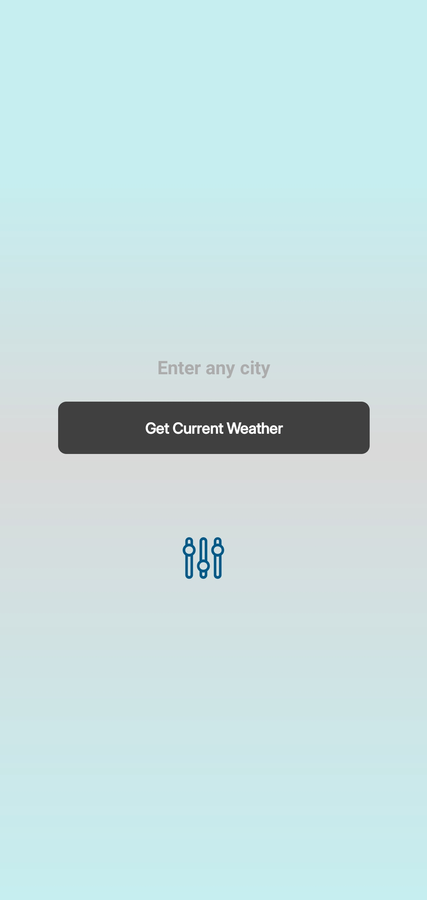
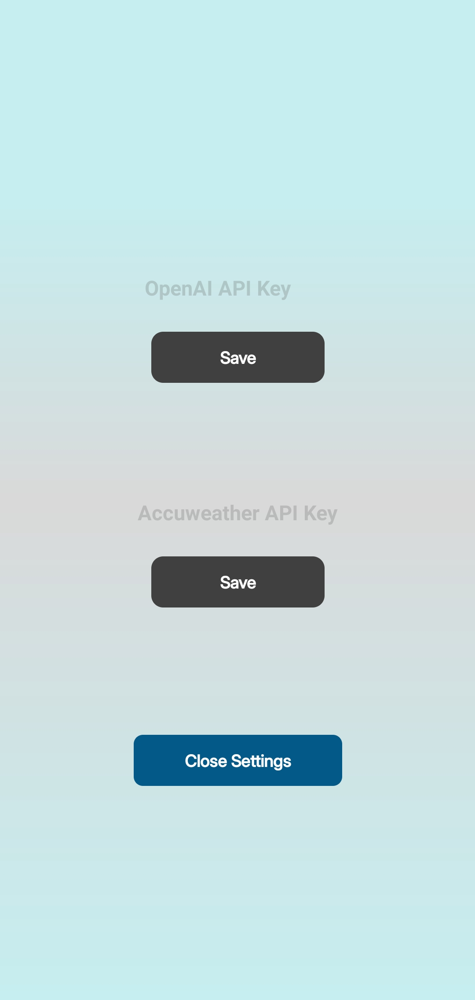
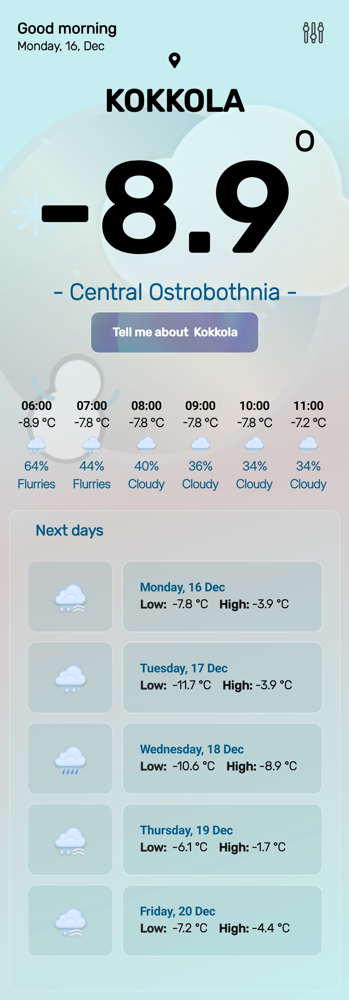
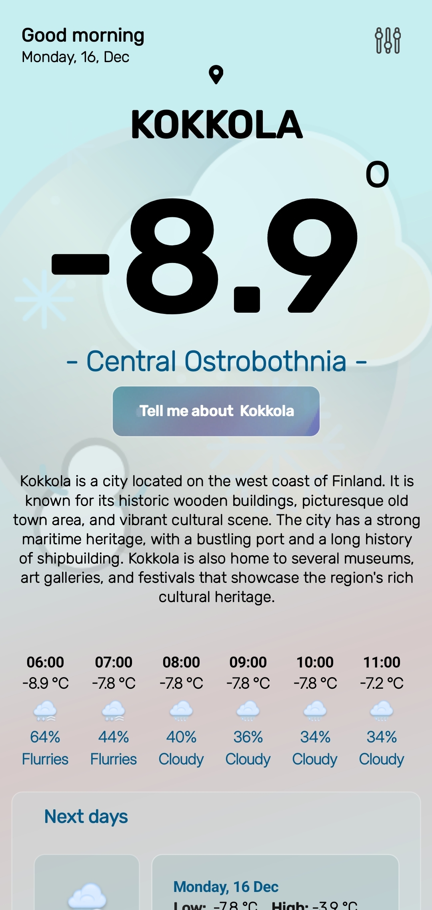
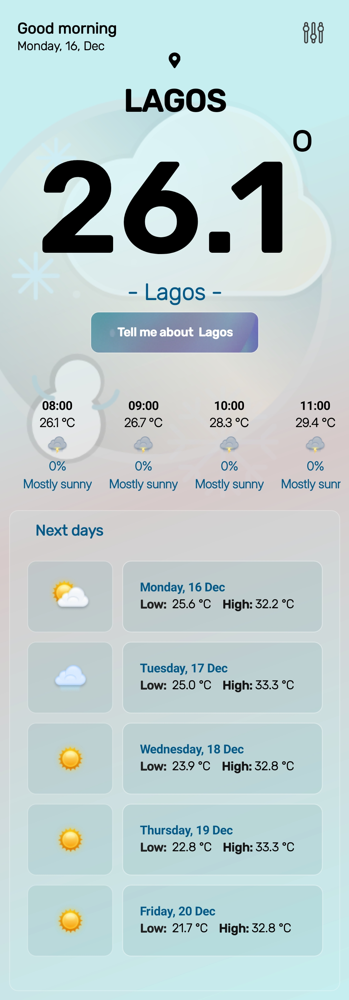
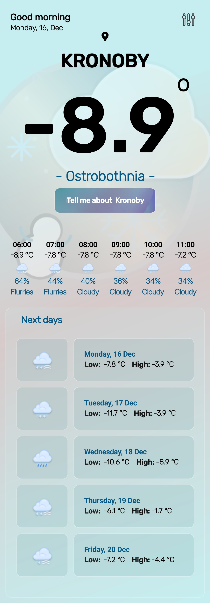
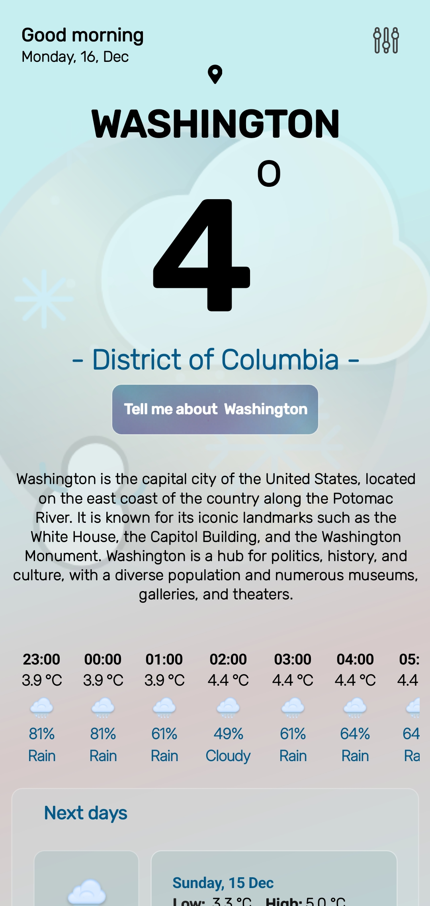
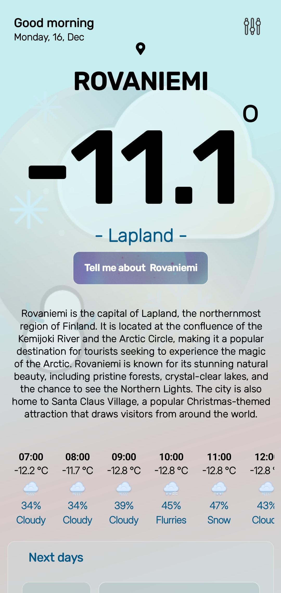
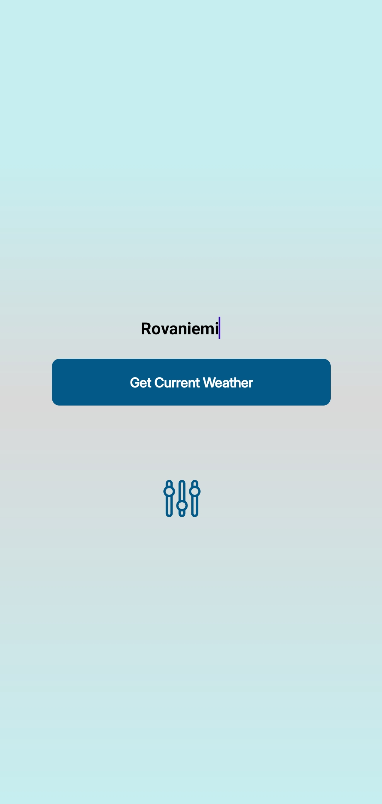

# MWeatherApp

MWeatherApp is a cross-platform weather application built with [.NET MAUI](https://learn.microsoft.com/en-us/dotnet/maui/what-is-maui), Utilizing the MVVM architectural pattern. This app provides real-time weather information using the [AccuWeather API](https://developer.accuweather.com/) and integrates AI services to offer detailed insights about cities. Sensitive data such as API keys are securely stored using Keychain (iOS) and Secure Storage (Android and Windows).

## Table of Contents

- [Features](#features)
- [Getting Started](#getting-started)
  - [Prerequisites](#prerequisites)
  - [Installation](#installation)
  - [Configuration](#configuration)
- [Architecture](#architecture)
- [Technologies Used](#technologies-used)
- [Screenshots](#screenshots)
- [Contributing](#contributing)
- [License](#license)

## Features

- **Cross-Platform Support**: Runs seamlessly on Android, iOS, macOS, and Windows.
- **MVVM Architecture**: Clean separation of concerns facilitates maintainability and testability.
- **AccuWeather Integration**: Fetches current weather conditions and forecasts.
- **AI-Powered City Details**: Provides enriched information about cities using integrated AI services.
- **Secure Storage**: Utilizes Keychain and Secure Storage for safeguarding API keys and sensitive data.
- **.NET 9**: Built with the latest features and improvements of .NET 9.

## Getting Started

### Prerequisites

- **.NET 9 SDK**: Install from [.NET Downloads](https://dotnet.microsoft.com/download/dotnet/9.0).
- **.NET MAUI Workload**: Install using the command:

  ```bash
  dotnet workload install maui
  ```

- **AccuWeather API Key**: Sign up at [AccuWeather Developer Portal](https://developer.accuweather.com/) to obtain an API key.
- **AI Service API Key**: Obtain API keys for AI services (e.g., OpenAI) if using AI features (App work with out AI Key).
- **Realease apk package has a built-In API key**: But you still need Acuweather Api key to use weather features.

### Installation

1. **Clone the Repository**

   ```bash
   git clone https://github.com/Michealdgreat/MWeatherApp.git
   ```

2. **Navigate to the Project Directory**

   ```bash
   cd MWeatherApp
   ```

3. **Restore NuGet Packages**

   ```bash
   dotnet restore
   ```

### Configuration

#### Storing API Keys Securely

The application uses secure storage mechanisms to store API keys. Follow the steps below to set up your keys:

1. **First-Time Setup Dialog**

   - When you run the app for the first time, a setup dialog will prompt you to enter your AccuWeather API key and AI service API key.
   - The keys will be securely stored using Keychain (iOS) or Secure Storage (Android and Windows).

2. **Manual Configuration (Optional)**

   - If you prefer to set the API keys manually, you can use the following code snippet in the `App.xaml.cs` file:

     ```csharp
     SecureStorage.Default.SetAsync("api_key", "YOUR_ACCUWEATHER_API_KEY");
     SecureStorage.Default.SetAsync("Open_api_key", "YOUR_AI_SERVICE_API_KEY");
     ```

### Running the Application

- **Android**

  ```bash
  dotnet build -t:Run -f net9.0-android
  ```

- **iOS**

  ```bash
  dotnet build -t:Run -f net9.0-ios
  ```

- **Windows**

  ```bash
  dotnet build -t:Run -f net9.0-windows
  ```

- **macOS**

  ```bash
  dotnet build -t:Run -f net9.0-maccatalyst
  ```

## Architecture

The application follows the MVVM (Model-View-ViewModel) architectural pattern:

- **Model**: Represents the data structures for weather information and city details.
- **View**: XAML pages that present the UI.
- **ViewModel**: Handles the presentation logic and data binding between the View and Model.

This separation allows for a clear organization of code, easier maintenance, and improved testability.

## Technologies Used

- **.NET 9**: Utilizing the latest features and enhancements available in the latest version of the framework.
- **.NET MAUI**: For building cross-platform native applications.
- **MVVM Toolkit**: Simplifies the implementation of the MVVM pattern.
- **AccuWeather API**: Provides comprehensive weather data.
- **AI Integration**: Enhances city information using AI services.
- **Keychain/Secure Storage**: Protects sensitive information across platforms.

## Video

[DOWNLOAD APP DEMO VIDEO](MWeatherApp/Documentation/Screen_Recording.mp4)

## Screenshots













## Contributing

Contributions are welcome! Here's how you can help:

1. **Fork the Repository**

   Click the "Fork" button at the top right of the repository page.

2. **Clone Your Fork**

   ```bash
   git clone https://github.com/Michealdgreat/MWeatherApp.git
   ```

3. **Create a Feature Branch**

   ```bash
   git checkout -b feature/YourFeatureName
   ```

4. **Commit Your Changes**

   ```bash
   git commit -am 'Add some feature'
   ```

5. **Push to the Branch**

   ```bash
   git push origin feature/YourFeatureName
   ```

6. **Open a Pull Request**

   Submit your pull request for review.

## License

This project is licensed under the MIT License - see the LICENSE file for details.

---

Feel free to reach out for any questions or assistance!
